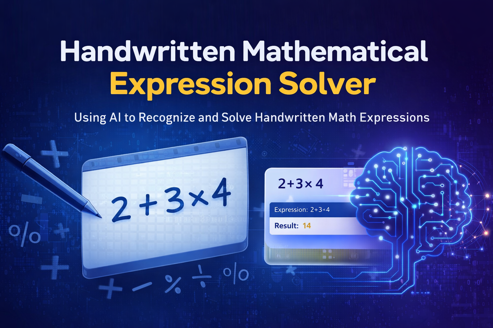
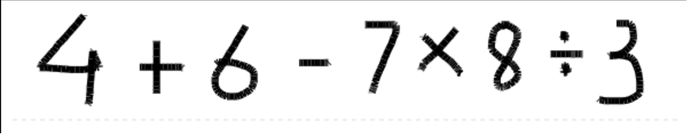
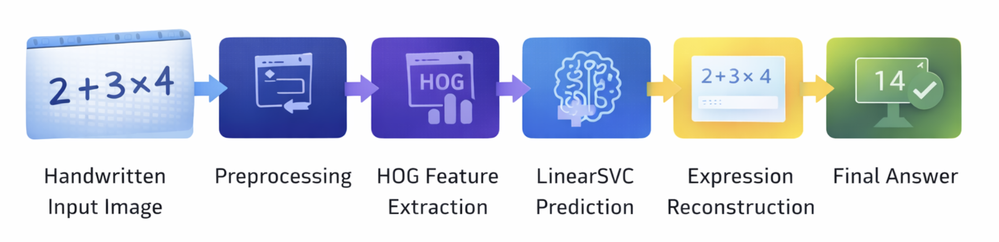
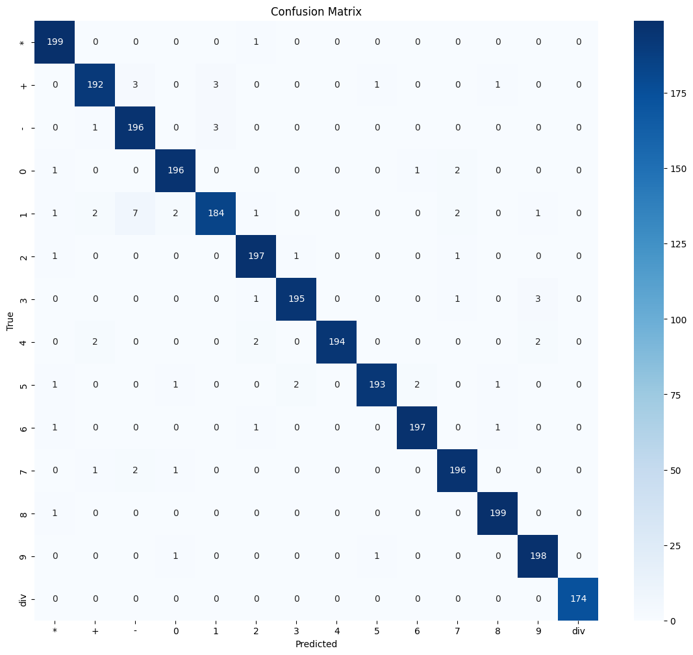
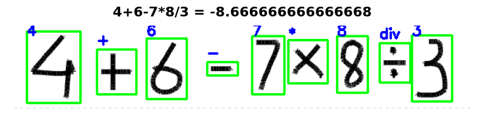

# Handwritten Mathematical Expression Solver



A machine learning-based application that recognizes **handwritten mathematical symbols**, converts them into a valid mathematical expression, and computes the final answer.

This project combines **Computer Vision**, **Feature Extraction**, and **Classical Machine Learning** to build an end-to-end handwritten math expression solver.

---

## 🚀 Features

- Recognizes handwritten mathematical symbols
- Supports digits **0–9**
- Supports operators:
  - `+`
  - `-`
  - `*`
  - `div`
- Solves complete handwritten expressions from images
- Includes an **interactive drawing interface**
- Uses **OpenCV**, **HOG**, and **Linear SVM**

---

## 📌 Project Overview

The goal of this project is to identify handwritten mathematical symbols, reconstruct the complete expression, and compute the final answer automatically.

### Sample Handwritten Input



### Example

**Input Image:**  
`2 + 3 × 4`

**Predicted Expression:**  
`2+3*4`

**Output:**  
`14`

---

## 🧠 Tech Stack

- **Python**
- **OpenCV**
- **NumPy**
- **scikit-learn**
- **scikit-image**
- **Joblib**
- **Matplotlib**
- **ipywidgets**
- **ipycanvas**
- **Jupyter Notebook**

---

## 📂 Dataset Structure

The dataset follows a **folder-per-class structure**:

```bash
MAIN_DATASET/
│── 0/
│── 1/
│── 2/
│── 3/
│── 4/
│── 5/
│── 6/
│── 7/
│── 8/
│── 9/
│── +/
│── -/
│── */
│── div/
```

Each folder contains images of a single handwritten symbol.

### Classes Used
- Digits: `0–9`
- Operators: `+`, `-`, `*`, `div`

### Dataset Size
- **13,868 total images**
- **14 classes**

---

## ⚙️ Workflow

The project follows the pipeline below:



### Processing Steps

1. **Input Image**
   - A handwritten mathematical expression is provided as input.

2. **Preprocessing**
   - Convert to grayscale
   - Apply Gaussian blur
   - Perform Otsu thresholding
   - Invert binary image
   - Crop symbol region
   - Resize to **64 × 64**

3. **Feature Extraction**
   - Extract **Histogram of Oriented Gradients (HOG)** features.

4. **Prediction**
   - Predict each handwritten symbol using **LinearSVC**.

5. **Expression Reconstruction**
   - Arrange symbols from left to right and reconstruct the mathematical expression.

6. **Final Answer**
   - Evaluate the predicted expression and return the computed result.

---

## 🏗️ Model Details

### Classifier Used
- **Linear Support Vector Machine (LinearSVC)**

### Training Configuration
- `C = 0.1`
- `class_weight = balanced`
- `max_iter = 20000`
- `dual = False`

### Train-Test Split
- **80% Training**
- **20% Testing**

---

## 📊 Results

The model achieved an overall accuracy of **98%** on the test dataset.

### Confusion Matrix



The confusion matrix shows strong classification performance, with most predictions correctly falling along the diagonal.

---

## 💾 Model Saving

The trained model is saved as:

```bash
MAIN_MODEL.pkl
```

This file stores:
- The trained classifier
- The label encoder

This allows the model to be reused later without retraining.

---

## ✍️ Interactive Solver

The project also includes an interactive Jupyter-based interface where the user can:

- Draw a handwritten mathematical expression
- Save the input
- Predict the expression
- View the final result instantly

### Demo Output



This makes the project practical, user-friendly, and easy to demonstrate.

---

## 📁 Project Structure

```bash
Handwritten-Math-Expression-Solver/
│── MAIN_DATASET/
│── MAIN_MODEL.pkl
│── handwritten_math_solver.ipynb
│── README.md
│── requirements.txt
│── assets/
│   │── banner.png
│   │── workflow.png
│   │── confusion_matrix.png
│   │── sample_input.png
│   │── output_demo.png
```

---

## ▶️ How to Run

### 1. Clone the Repository

```bash
git clone https://github.com/rud12/Handwritten-Math-Expression-Solver.git
cd Handwritten-Math-Expression-Solver
```

### 2. Install Dependencies

```bash
pip install -r requirements.txt
```

### 3. Open Jupyter Notebook

```bash
jupyter notebook
```

### 4. Run the Notebook

Open:

```bash
handwritten_math_solver.ipynb
```

Then execute all cells.

---

## 📦 Requirements

Create a `requirements.txt` file with:

```txt
opencv-python
numpy
scikit-learn
scikit-image
matplotlib
joblib
ipywidgets
ipycanvas
jupyter
```

---

## 🔮 Future Improvements

- Add support for more operators such as:
  - `^`
  - `=`
  - parentheses
- Improve segmentation for more complex handwritten expressions
- Replace classical ML with a **CNN-based deep learning model**
- Deploy the project as a **web application**
- Improve recognition for noisier handwriting samples

---

## 📚 References

- OpenCV Documentation
- scikit-learn Documentation
- scikit-image Documentation
- Joblib Documentation
- ipycanvas Documentation
- ipywidgets Documentation

---

## 👨‍💻 Author

**Rudra Kachhia**

If you found this project useful, feel free to ⭐ the repository.
